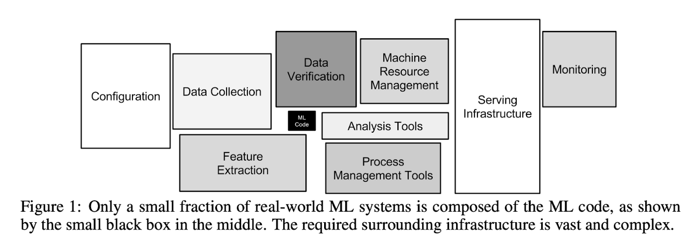
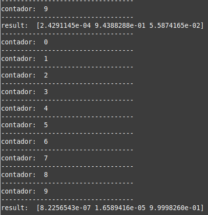

## **Parte 03: Creación, Exportación e Invocación de Modelo de ML para reconocimiento de Gestos en tiempo real**

### **3.1 Pasos de un Proceso de Machine Learning:**
- **Paso 1: Comprensión y definición del problema**
- **Paso 2: Adquisición de los datos**
    - Selección de las variables
    - Determinación de las fuentes de datos
- **Paso 3: Preprocesamiento de los datos**
    - Limpieza de los datos Nivel I:
        - Estandarizar la estructura de los datos.
        - Nombres de los atributos codificables e intuitivos.
        - Entidades con identidad única.
    - Limpieza de los datos Nivel II:
        - Preparar los datos a una estructura específica para desarrollar nuestra meta analítica.
        - Desempaquetar los datos.
        - Reestructurar los datos.
        - Reformular los datos.
    - Limpieza de datos Nivel III:
        - Asegurar que los datos sean correctos, coherentes y apropiados, se deben gestionar.
        - Datos anómalos.
        - Datos erróneos.
        - Datos faltantes.
    - Fusión e integración de datos:
        - Un solo conjunto de datos formado con diversas fuentes para cumplir con nuestras metas analíticas.
    - Reducción de datos:
        - Reducción del tamaño de nuestro conjunto de datos.
    - Transformación de datos:
        - Necesario para ser utilizado por el método analítico.
        - Evita resultados engañosos y equivocados.
        - Mejora el resultado del método analítico.
- **Paso 4: Análisis de los datos**
    - Análisis exploratorio de los datos.
    - Visualización de los datos.
    - Ingeniería de características.
- **Paso 5: Desarrollo del modelo de de Machine Learning**
    - Construcción del modelo de Machine Learning.
    - Evaluación del modelo de Machine Learning.
    - Selección del modelo ganador.
- **Paso 6: Despliegue del modelo de pronóstico**
Automatizar:
    - Extracción de datos.
    - Procesamiento de los datos en el formato que requiere el modelo.
    - Ejecución del modelo.
    - Obtención de la inferencia del modelo.
- **Paso 7: Mantenimiento del modelo de pronóstico**
    - Monitoreo y verificación continua del cumplimiento de los estándares de desempeño del modelo.
    - Reentrenamiento y ajuste del modelo.
    - Crear nuevo modelo, de ser necesario.

### **3.2 Objetivo:**
- El objetivo es detectar 3 tipos de movimientos (reposo, lineal y angular) con el sensor MPU6050 leyendo las aceleraciones lineales y angulares.
- Esto se realizará invocando a un modelo de Machine Learning en formato "**TensorFlow Lite**".
- La data se muestreará cada 0.1s (['Ax','Ay','Az','Gx','Gy','Gz']).
- Se tomarán 10 puntos de datos, osea cada 1s, y se calculará la media y desviación estándar de la acelaración lineal y angular total del último segundo ['A_mean','G_mean','A_std','G_std'], esta data se le pasará al modelo para que realice su predicción.

### **3.3 Pasos del Laboratorio:**

- Descargar el archivo "**Intermediate_ML_Model.ipynb**".
>`https://iot-lab-bucket.s3.amazonaws.com/unamad_mayo_lab01_parte03/Intermediate_ML_Model.ipynb`

- Descargamos los siguientes datasets recolectados "**data_reposo.csv**", "**data_horizontal.csv**", "**data_angular.csv**".
>`https://iot-lab-bucket.s3.amazonaws.com/unamad_mayo_lab01_parte03/datasets/recolectados/data_angular.csv`

>`https://iot-lab-bucket.s3.amazonaws.com/unamad_mayo_lab01_parte03/datasets/recolectados/data_horizontal.csv`

>`https://iot-lab-bucket.s3.amazonaws.com/unamad_mayo_lab01_parte03/datasets/recolectados/data_reposo.csv`

- Creamos una carpeta en "**Google Drive**", y subimos ahí el notebook y los 3 datasets recolectados.
- Se explicará paso a paso las instrucciones del código.
- El resultado de este notebook es un archivo en formato "**.tflite**", que es la transformación de nuestro modelo a "**TensorFlow Lite**", que es el modelo pero con optimizaciones aplicadas para que se pueda ejecutar más rápidamente en nuestra "**RPI**".
- Ir a nuestra "**Raspberry**", ingresamos por "**SSH**" a la terminal.
- Vamos al escritorio.
>`cd ~/Desktop`

- Creamos una nueva carpeta.
>`mkdir Parte_03`

- Vamos a la nueva carpeta.
>`cd Parte_03`

- Descargamos los siguientes archivos.
>`curl -O https://iot-lab-bucket.s3.amazonaws.com/unamad_mayo_lab01_parte03/ML_MPU6050.py`

>`curl -O https://iot-lab-bucket.s3.amazonaws.com/unamad_mayo_lab01_parte03/requirements.txt`

>`curl -O https://iot-lab-bucket.s3.amazonaws.com/unamad_mayo_lab01_parte03/model.tflite`

- Instalar las librerías necesarias:
>`pip install smbus2`

>`pip install numpy`

- Para la Raspberry Pi 4.
>`python3 -m pip install tflite-runtime`

>`pip3 install https://github.com/google-coral/pycoral/releases/download/v2.0.0/tflite_runtime-2.5.0.post1-cp39-cp39-linux_armv7l.whl`

- Referencia para instalación: https://github.com/thyagarajank/Object-Detection-with-Voice-Feedback-using-Raspberry-Pi-4-and-bullseye-OS

- Para verificar la correcta instalación de "**tflite**", no debería retornar ningún error:
>`python3`

>`import tflite_runtime.interpreter as tflite`

- Ejecutar el programa:
>`python3 ML_MPU6050.py`

