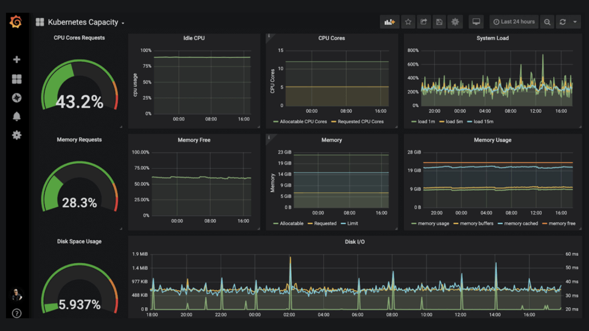

# **Laboratorio 01: Monitoreo, Visualización, Alertas y creación de Modelo Intermedio de Machine Learning en el Borde con una Raspberry Pi**
## **1. Pre-Requisitos**:
- Raspberry Pi 4 con Raspberry OS instalado.

## **2. Materiales**:
- Raspberry Pi 4 y accesorios.
- Sensor MPU6050 (Acelerómetro y Giroscopio).
- Jumpers hembras y macho para conectar el sensor al MPU6050.

## **3. Descripción General:**

### **3.1 Parte 01:**
- **Objetivo:** 
    - Lectura de las aceleraciones lineales con el Raspberry Pi 4 y el sensor MPU6050 e imprimirlas en la terminal y guardarlas en un archivo csv.

### **3.2 Parte 02:**
- **Objetivo:**
    -  Instalar el software necesario para almacenar y visualizar la data enviada por el MPU6050.
        - Modificar el programa anterior para publicar la data a un tópico del Broker Server.
        - Instalar el Broker Server Mosquitto.
        - Instalar Node-RED, que servirá como puente entre el Broker Server y el InfluxDB para almacenar la data.
        - Instalar InfluxDB, base de datos de series de tiempo.
        - Instalar Grafana para visualizar la data almacenada en nuestra base de datos.

### **3.3 Parte 03:**
- **Objetivo:**
    - Desarrollar un modelo de ML más avanzado para identificar ciertos movimientos del sensor MPU6050, exportarlo y luego invocarlo desde nuestro programa para que realice una predicción.

## **MQTT**
- El protocolo MQTT provee un método ligero de mensajería utilizando un modelo publicador/suscriptor.
- Adecuado para mensajería IoT.

## **Mosquitto**
- Broker de mensajería Open Source que implementa el protocolo MQTT versión 5.0, 3.1.1 y 3.1.
- Ligero y adecuado para SBC de bajo consumo y servidores completos.
- Provee librería en C para implementar clientes MQTT e interfaz de líneas de comandos "**mosquito_pub**" y "**mosquitto_sub**".

## **Node-RED**

## **InfluxDB**
- Base de datos de Series de Tiempo de alto desempeño.
- Puede almacenar data desde cientos a miles de puntos por segundo.
- Tiene su propio lenguaje de query, similar a SQL.
- Open Source.
- Escrita en Go.
- Optimizada para la recuperación y almacenamiento de datos, adecuada para IoT.

## **Grafana**
- Aplicación web.
- Open Source.
- Multi-plataforma.
- Utilizado principalmente para visualización interactiva y analítica.
- Se puede instalar con Docker.

https://grafana.csselectronics.stellarhosted.com/d/6qvL9OvMz/css-playground-obd2?orgId=1

## **TensorFlow Lite**

